# Bas's Tools

## Color Picker

### Concept & Sketch

####'Vleugje karamel'

A Plugin for Photoshop and Illustrator. When it's hard to choose a color for your design, you can use the tool 'Vleugje karamel'. The tool is based on the colorfamilies of 'Flexa - Let's colour'. The color of flexe are based on names from everyday life. You can choose for example a flower, fruit or many other things from everyday life. 
U can combine these colors for your own color palette. 

Example: 'Vleugje pompoen', '86% framboos' and 'een vleugje appel'

What you see is that you can make a color combination based on a recipe. 

### Prototype
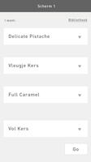 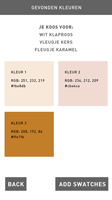 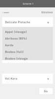 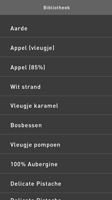 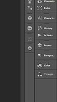

## Your Own Tool

### Concept
The tool 'WHAT HAVE I DONE?' gives you al the information about your process. When you turn on the tool, the tool will start collecting data from your computer. Every time you are using the tool, it makes a new folder in your 'WHAT HAVE I DONE' folder. The tool creates 3 folder within 3 different types of files.
 
Folder 1: Screenshots (JPEG)

Folder 2: Graps (PDF)

Folder 3: .txt file

The tool collects data about your working process. Think about the open programs, how much time you're spending in a program, time whene you're doing nothing etc. 

It also takes every 20sec a screenshot. After the session you can see your complete session. 

### Sketch
The first sketches are on paper. 

### Demo

####[Demo](https://vimeo.com/159338026 )

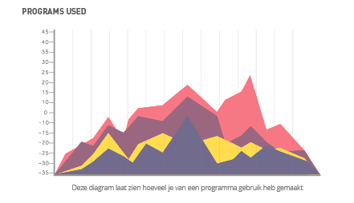

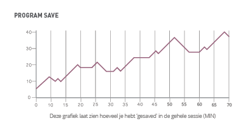

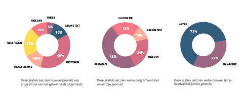

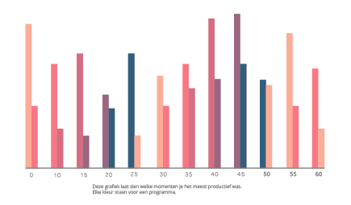

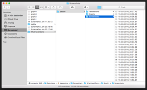 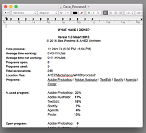

### How to install and use

Create a new folder with the txt file and the screenshot tool.

First open your terminal. You can find the terminal  applications > terminal.
For the shortcut use the CMD and the spacebar. The spotlight window will open and you can type 'terminal. 

######New Folder
First we want to make a new folder in the 'WHAT HAVE I DONE' folder.
- Start with pwd and enter. Now you can see where you are.
 
- When you type 'ls', you van see al your folders. 

-  Now searching for the right map. Start with 'cd' and the name of the folder.    	Now you're in the right folder. 

- Repeat the 'cd' command followed bij 'WHAT HAVE I DONE' and press enter.

- Type 'mkdir [foldername] and hit enter. The terminal made a new folder.

######New Text File

We want to add a text file into the new folder.

- Repeat the pwd - ls - cd command for searching the folder.

- type 'touch file.txt' for a new text file.

 
######The Screenshot Tool

The screenshot tool makes every 30 sec autnomatic a new screenshot intro the 'WHAT HAVE I DONE' folder. 

- Copy and past the code: while [ 1 ];do vardate=$(date +%d\-%m\-%Y\_%H.%M.%S); screencapture -t jpg -x ~/Desktop/ProcesTool/$vardate.jpg; sleep 20; done

You can change the time of the screenshot with 'sleep 20'. For change the save folder: ~/Desktop/ProcesTool/$vardate.jpg;

The tool makes now every 20 sec a screenshot and put it in the folder you want. 

Good luck!

