# Esmee's Tools

## Color Picker Concept 

#####Remove Shadow

You're thinking about to paint a wall in your house, but a part of the wall is predominates of shadows. 
Now you have choosen a color but a part of the wall is darker because of the shadow then the color that you wanted. This color picker makes your wall balanced in one color. 

This color picker translates different color gradient on the picture of the wall in one equal colors.  With this you're wall has one color. The sun with it's shadows plays no role anymore. 

The Color picker is inspired by the Mitre 10 Virtual Wall Painter.

### Color Picker Sketch
#####Demo

[Schets 1 demo](ColorPicker/Schets1.pdf)

#####Manquette

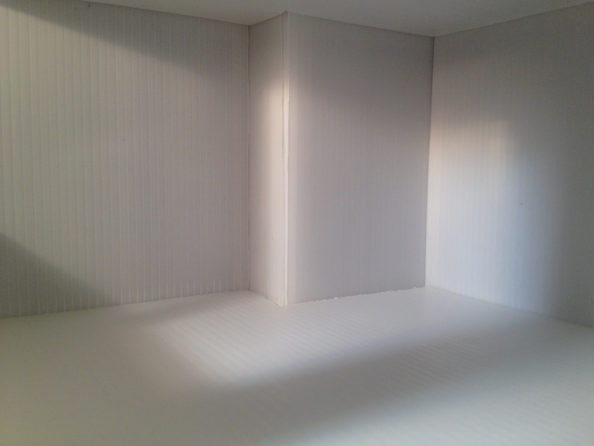
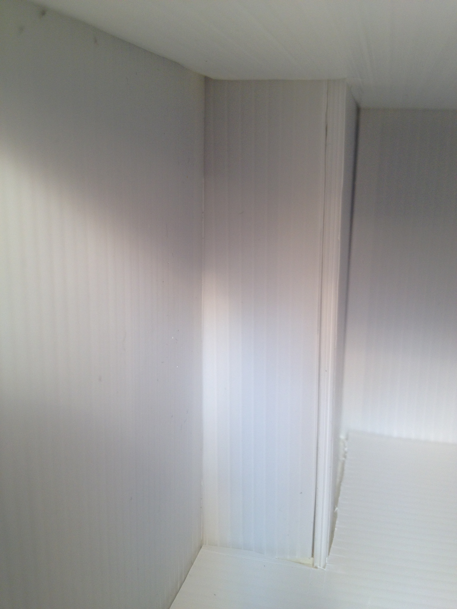  
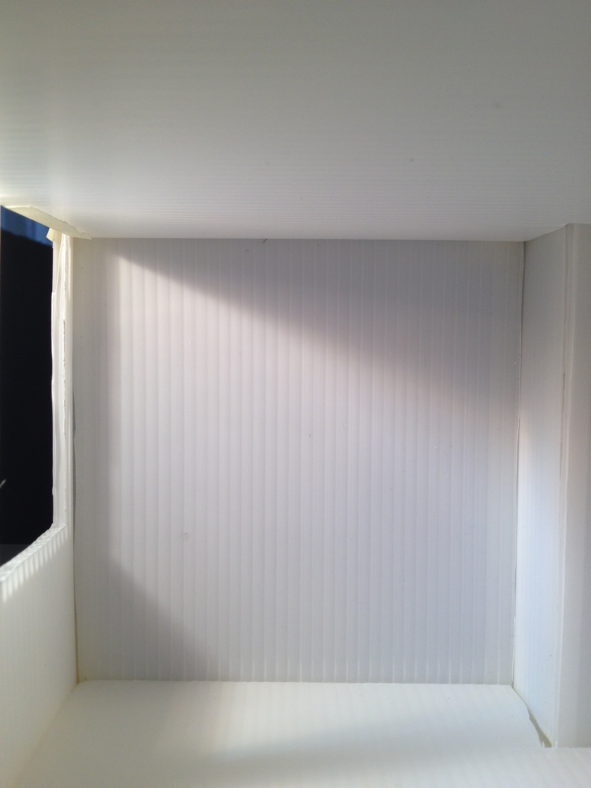  
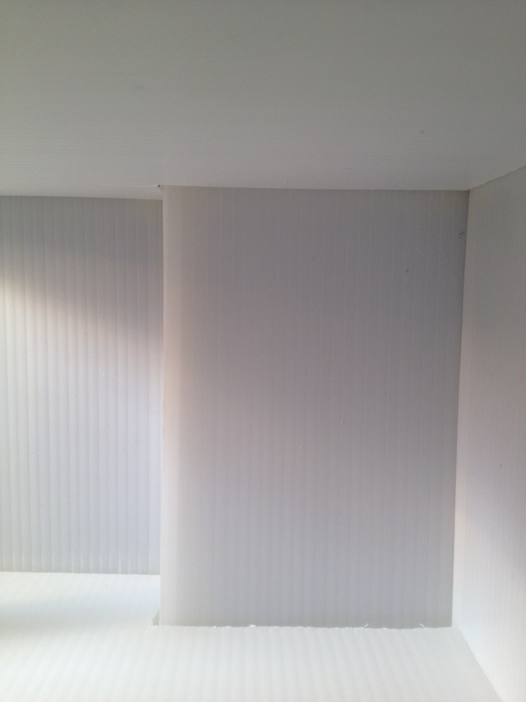

With paint

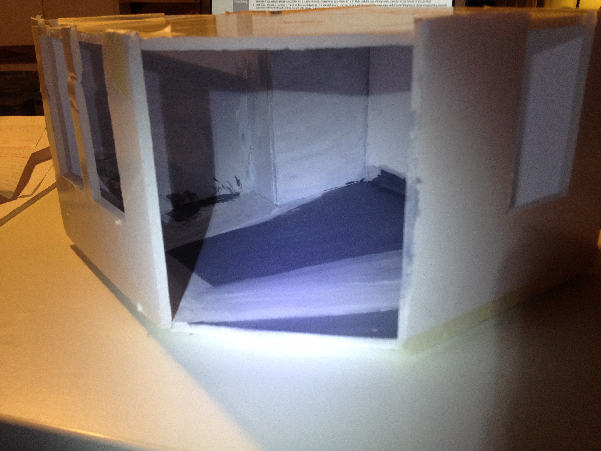  
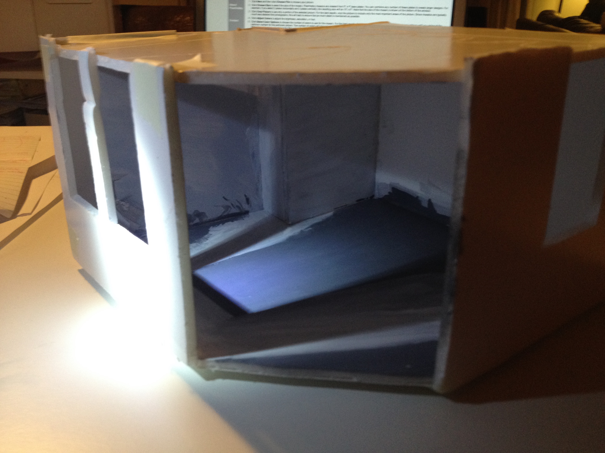  
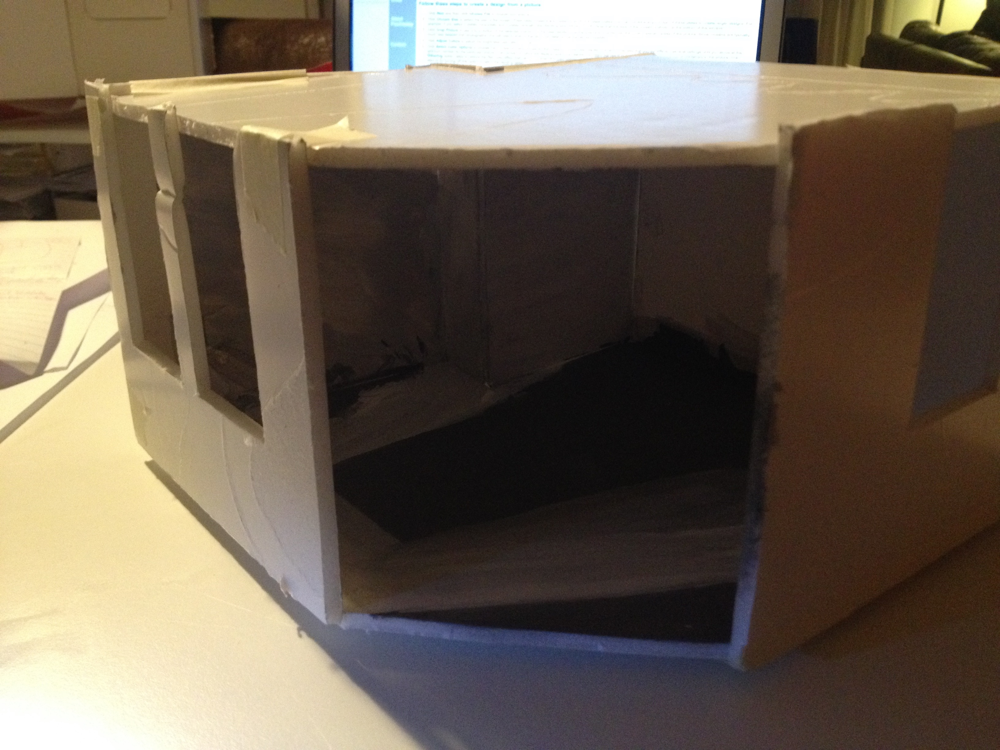

Printer inkt

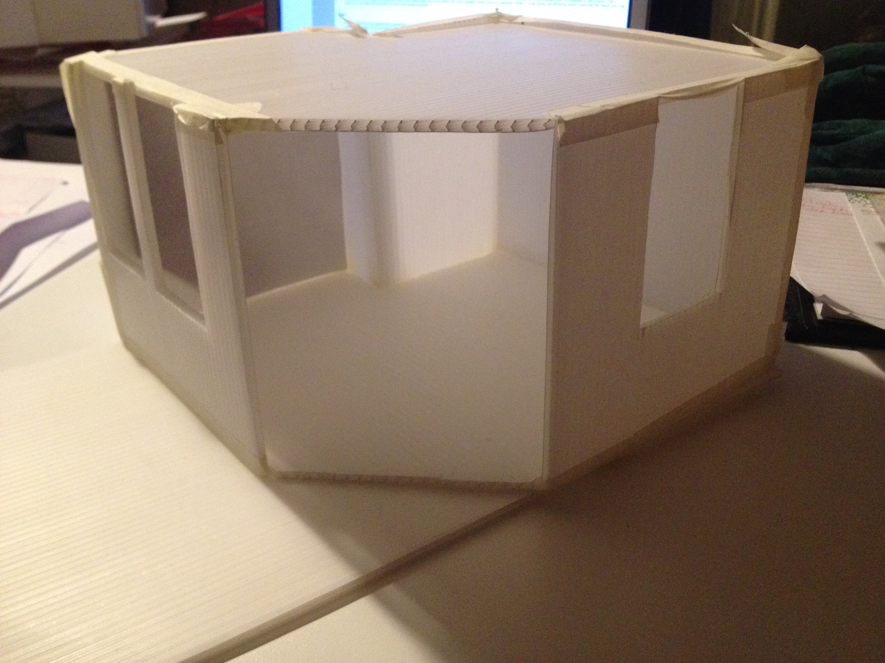  
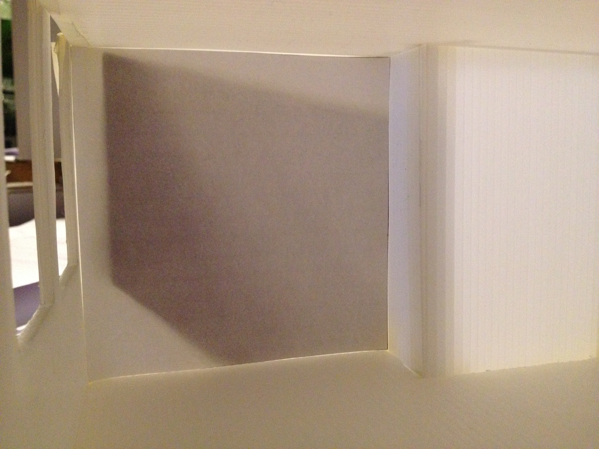  
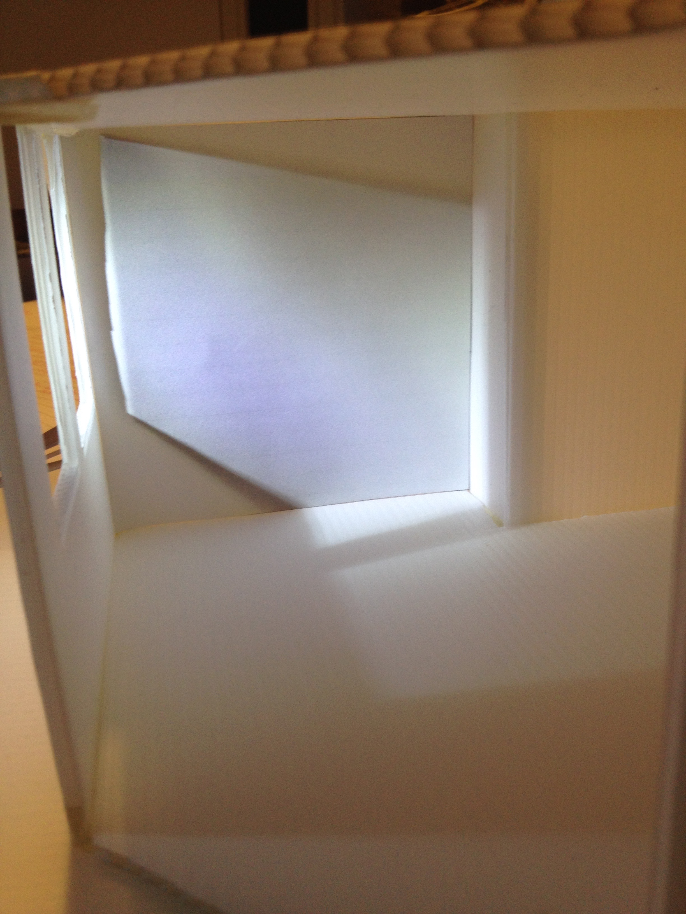  
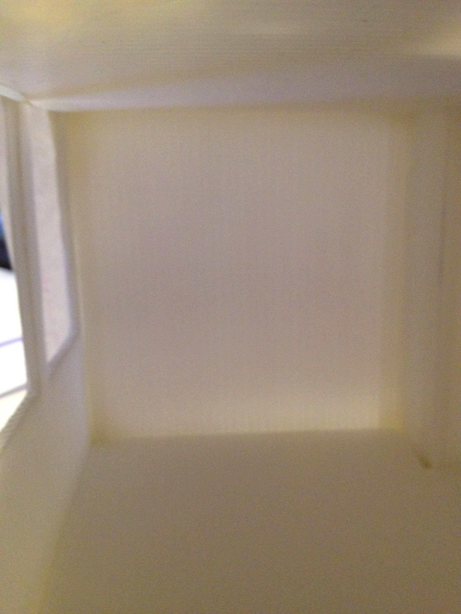

### Color Picker Prototype

#####Demo

Step 1: You make a picture of the wall or import an image. 

Step 2: Select the color that you want.

Step 3: Count al de different colors of the wall.

Step 4: Shows you a equal color wall.

Step 5: Shows you a sheet what you need on your wall.

#####Manquette

## Your Own Tool

### Ruler Tool Concept
In Indesign, Photoshop and Illustrator are the pageviews different by every percent. When you want 100% pageview it's in indesign smaller then in photoshop. The problem is you whant to see an A4 page but when you take it om you screen it's bigger or smaller. How do you know if the image and text are too big or too small?

The Ruler Tool gives you full size images where you can compare now if you image is bigger then you own pen. It makes it easyer to reference your design to objects that you carry.

The Color picker is inspired by http://morris-photographics.com/photoshop/shortcuts/index.html

### Ruler Tool Sketch

Indesign format:

100%

  

  

Photoshop format:

16,7%  25$  

50%   100% 

### Ruler Tool Demo

#####[Movie](Sketch-03.mov)
 

[How to use](Use_WikiCounter_.mp4)

### How to install and use
This script combines a series of images from the selected folder into a new document. All layers are named according to the file they represent. The script handles various formats, color modes, and bit-depths, and even preserves transparency.

#####Download
To download this script, see map: Ruler (Ctrl-click on the Mac), and choose "Save Target As". Save the folder Ruler on your Desktop.

Download the script and copy it from your Desktop into your "Adobe Photoshop CC or CS#/Presets/Scripts" folder.

#####Installation
After restarting Photoshop, the script should appear in the File > Scripts menu > Browse to find your folder.

#####Add

You can add you own images in this folder. Cut your object out the background and then it's transparent. Save them in Photoshop at full size to PNG. PNG saves your transparent background.

##License (MIT License)

Apeace Leaflet is released under the MIT license.

Copyright © 2016 Esmee Ellson

Permission is hereby granted, free of charge, to any person obtaining a copy of this software and associated documentation files (the “Software”), to deal in the Software without restriction, including without limitation the rights to use, copy, modify, merge, publish, distribute, sublicense, and/or sell copies of the Software, and to permit persons to whom the Software is furnished to do so, subject to the following conditions:

The above copyright notice and this permission notice shall be included in all copies or substantial portions of the Software.

THE SOFTWARE IS PROVIDED “AS IS”, WITHOUT WARRANTY OF ANY KIND, EXPRESS OR IMPLIED, INCLUDING BUT NOT LIMITED TO THE WARRANTIES OF MERCHANTABILITY, FITNESS FOR A PARTICULAR PURPOSE AND NONINFRINGEMENT. IN NO EVENT SHALL THE AUTHORS OR COPYRIGHT HOLDERS BE LIABLE FOR ANY CLAIM, DAMAGES OR OTHER LIABILITY, WHETHER IN AN ACTION OF CONTRACT, TORT OR OTHERWISE, ARISING FROM, OUT OF OR IN CONNECTION WITH THE SOFTWARE OR THE USE OR OTHER DEALINGS IN THE SOFTWARE.

