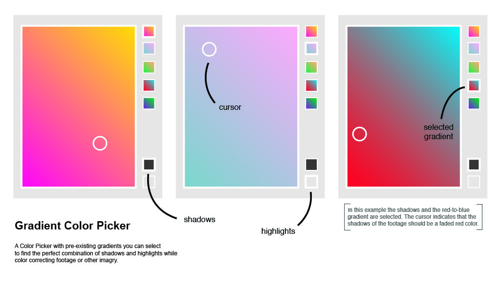

# Heike's Tools

## Color Picker

### Concept & Sketch


### Prototype

[Gradient Color Picker Demo](https://youtu.be/xa_JpkCI5SY)


## Your Own Tool

### Concept
For Design Research I am working on a project, that requires scraping a webpage (Wikipedia Recent Changes) of IP-Addresses, and translates them to GEO-loactions. To speed up this process, I want to create a tool.

### Sketch
Code that I have found:

<http://pythonhosted.org/python-geoip/>

```
pip install python-geoip-geolite2
```

```
>>> from geoip import geolite2
>>> match = geolite2.lookup('17.0.0.1')
>>> match is not None
True
>>> match.country
'US'
>>> match.continent
'NA'
>>> match.timezone
'America/Los_Angeles'
>>> match.subdivisions
frozenset(['CA'])

```
For this code you have to install the geolite2 database at <http://maxmind.com> and pip at <https://pip.pypa.io/en/latest/installing/>

<http://www.pythonforbeginners.com/beautifulsoup/script-get-the-geo-location-of-an-ip-address>

```
import re
import sys
import urllib2
import BeautifulSoup

usage = "Run the script: ./geolocate.py IPAddress"

if len(sys.argv)!=2:
    print(usage)
    sys.exit(0)

if len(sys.argv) > 1:
    ipaddr = sys.argv[1]

geody = "http://www.geody.com/geoip.php?ip=" + ipaddr
html_page = urllib2.urlopen(geody).read()
soup = BeautifulSoup.BeautifulSoup(html_page)

# Filter paragraph containing geolocation info.
paragraph = soup('p')[3]

# Remove html tags using regex.
geo_txt = re.sub(r'<.*?>', '', str(paragraph))
print geo_txt[32:].strip()

```
For this code you have to download BeautifulSoup from <https://pypi.python.org/pypi/beautifulsoup4>

**Other tools that can help with this process:**

[Digital Methods' URL and/or IP to GEO](https://tools.digitalmethods.net/beta/geoIP/) (which does not actually work with URLs with IP-addresses in the text)

[Regular Expressions](http://regexr.com)

```
[0-9]{1,3}\.[0-9]{1,3}\.[0-9]{1,3}\.[0-9]{1,3}

```
Using this code to extract IP-addresses from text

### Demo

[URL2GEO Demo](https://youtu.be/R3Afdkv0DI4)

### How to install and use
URL2GEO

**What the tool does:**
This tool scrapes IP-addresses from a webpage and translates them to GEO-locations.

**How to install:**
//

**Screenshots:**
//

**Examples of use:**
On pages where you can find IP-addresses in the html-text. Such as Wikipedia history pages or Wikipedia Recent changes.

**Dependancies:**
This tool is either dependant on the python module ***pip*** and the <http://maxmind.com> geolite2 database or on the python module ***BeautifulSoup***. Both require Apple OS X Yosimite or higher including a terminal.

**License:**

The MIT License (MIT)

Copyright (c) <year> <copyright holders>

Permission is hereby granted, free of charge, to any person obtaining a copy of this software and associated documentation files (the "Software"), to deal in the Software without restriction, including without limitation the rights to use, copy, modify, merge, publish, distribute, sublicense, and/or sell copies of the Software, and to permit persons to whom the Software is furnished to do so, subject to the following conditions:

The above copyright notice and this permission notice shall be included in all copies or substantial portions of the Software.

THE SOFTWARE IS PROVIDED "AS IS", WITHOUT WARRANTY OF ANY KIND, EXPRESS OR IMPLIED, INCLUDING BUT NOT LIMITED TO THE WARRANTIES OF MERCHANTABILITY, FITNESS FOR A PARTICULAR PURPOSE AND NONINFRINGEMENT. IN NO EVENT SHALL THE AUTHORS OR COPYRIGHT HOLDERS BE LIABLE FOR ANY CLAIM, DAMAGES OR OTHER LIABILITY, WHETHER IN AN ACTION OF CONTRACT, TORT OR OTHERWISE, ARISING FROM, OUT OF OR IN CONNECTION WITH THE SOFTWARE OR THE USE OR OTHER DEALINGS IN THE SOFTWARE.

## Other Homework

