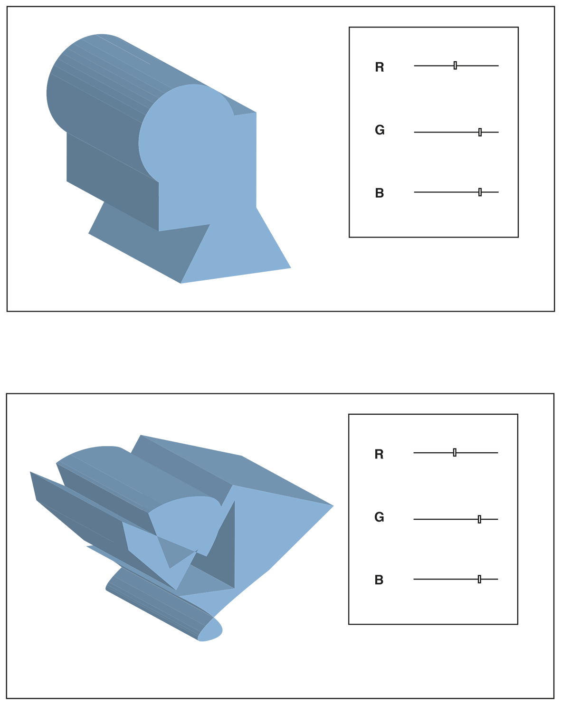

# Jeanine's Tools

## Color Picker

### Concept & Sketch

Colors come to life in 3D. In one of the classes we were shown a 3d pyramid shape were colors could be in detected. I thought this was a fascinating thing so I based my color picker on this concept. Because we can all see color, but what kind of shape is connected with that color? So I want to connect a range of shapes to the RGB colors. If you start with blue the shape will be a square. But if you add a little red, the shape will change. You'll have these sliders next to your shape to play with.

[circle_sketch](https://youtu.be/GBtdViaDUaM)
[piramid_sketch](https://youtu.be/n8JbLBBje7c)
[square_sketch](shttps://youtu.be/HfkEdZVt6Pk)

### Prototype

[demo_01](https://youtu.be/sRYCK6m6qWI)
[demo_02](https://youtu.be/7CHiderlJcU)

## Your Own Tool

### Concept

One of my big annoyances is when I take a screenshot it will automatically be saved on my desktop. But what I want is a pop up/ dialog that will ask me where I want my screenshot to be saved and what it should be called. So that it will be orderly  saved. 

I would like to have my tool on a certain key combination. So that it would be very easy and quick to use. 

### Sketch

[before](https://youtu.be/LVFvG-Qv71A)
[after](https://youtu.be/oM6Wa12CRFs)

### Demo

[demo](https://youtu.be/3jPiVgP3OEA)

### Code

[sketch_01](Schets_01.scpt)
[sketch_02](Schets_02.scpt)
[sketch_03](Schets_03.scpt)

### How to install and use

For my tool you will need AppleScript. This program will run the code. The downside of this application is that it will only run on Apple computers because it needs Mac OS.

I know where I can find the key combinations in preferences, but I don't know how to change them. Because it looks like there locked. 

## Other Homework

