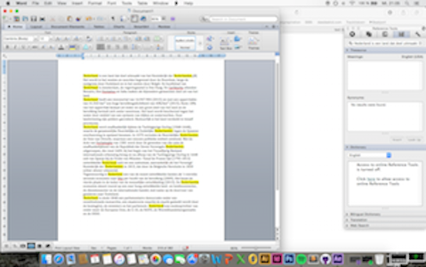

# Jesse's Tools

## Color Picker

### Concept & Sketch

Omdat ik niet meer dagen wil bezig zijn met het printen van testjes en het uitvinden van de juiste kleuren die ik nodig heb, wil ik een tool maken waarmee je een kleur van een logo of poster kan selecteren en defineren.
Het defineren werkt als volgt: Je selecteert een kleur en de tool kiest de 5-8 dichstbijzijnde kleuren die bij de geselecteerde kleur passen uit.

Uiteindelijk kan je de uitgekozen kleuren uitprinten en daaruit de passende kleur kiezen.

De kleuren worden gedefineerd als RGB, CMYK, HEX of Pantone

### Prototype

### Demo

[Demo](https://youtu.be/uWloph7_jL4)

## Your Own Tool

### Concept

Bij texten of voorbeelden moet iedereen steeds een hele text uitkiezen en copieeren in plaats van enkele woorden te kunnen selecteren.
Mijn tool maakt dit mogelijk.
Door enkele woorden in een te selecteren en te kopieren worden de woorden opgeslagen.
Wanneer alle woorden geselecteerd en gecopieert zijn kunt u deze in een InDesign of Word-bestand plaatsen.
De woorden zijn op de volgorde geordend die u bij het selecteren en copieeren aanhoudt.

De tool werkt niet als Office Clipboard.
Bij Office Clipboard heeft u de mogelijkheid woorden of hele texten uit een Wordbestand te "cutten", als u het vlak "cut" drukt, word de geselecteerde text in een venster links opgeslagen.
Dit kunt u dan met zoveel texten of woorden doen en ze allemaal opslaan in het venster links. De volgorde is niet belangrijk.
Als u klaar bent met selecteren en "cutten" kunt u links in het venster per woord uitkiezen wat u wilt doen.
Er bestaan twee mogelijkheden: "paste" en "delete".
De volgorde die u aanhoudt bij het plakken is wél belangrijk, zo kunt u dus text en woorden in een volgorde zetten die u niet had toen u bijvoorbeeld de woorden of texten van een internetsite gecopieert heeft.

### Sketch

### Demo

In de demo laat ik u zien hoe de tool werkt.

[Demo](https://youtu.be/3Wd9ZBzuSIM)

### How to install and use

U installeert de tool als plugin op uw computer en kunt hem aan- of uitschakelen in de finderbalk. 

### License

The MIT License (MIT)

Copyright (c) 2016 Graphic Design Arnhem at ArtEZ Academy

Permission is hereby granted, free of charge, to any person obtaining a copy of this software and associated documentation files (the "Software"), to deal in the Software without restriction, including without limitation the rights to use, copy, modify, merge, publish, distribute, sublicense, and/or sell copies of the Software, and to permit persons to whom the Software is furnished to do so, subject to the following conditions:

The above copyright notice and this permission notice shall be included in all copies or substantial portions of the Software.

THE SOFTWARE IS PROVIDED "AS IS", WITHOUT WARRANTY OF ANY KIND, EXPRESS OR IMPLIED, INCLUDING BUT NOT LIMITED TO THE WARRANTIES OF MERCHANTABILITY, FITNESS FOR A PARTICULAR PURPOSE AND NONINFRINGEMENT. IN NO EVENT SHALL THE AUTHORS OR COPYRIGHT HOLDERS BE LIABLE FOR ANY CLAIM, DAMAGES OR OTHER LIABILITY, WHETHER IN AN ACTION OF CONTRACT, TORT OR OTHERWISE, ARISING FROM, OUT OF OR IN CONNECTION WITH THE SOFTWARE OR THE USE OR OTHER DEALINGS IN THE SOFTWARE.

THE SOFTWARE IS PROVIDED "AS IS", WITHOUT WARRANTY OF ANY KIND, EXPRESS OR IMPLIED, INCLUDING BUT NOT LIMITED TO THE WARRANTIES OF MERCHANTABILITY, FITNESS FOR A PARTICULAR PURPOSE AND NONINFRINGEMENT. IN NO EVENT SHALL THE AUTHORS OR COPYRIGHT HOLDERS BE LIABLE FOR ANY CLAIM, DAMAGES OR OTHER LIABILITY, WHETHER IN AN ACTION OF CONTRACT, TORT OR OTHERWISE, ARISING FROM, OUT OF OR IN CONNECTION WITH THE SOFTWARE OR THE USE OR OTHER DEALINGS IN THE SOFTWARE.
