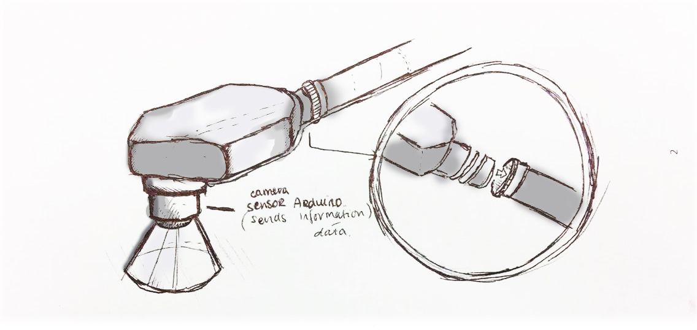
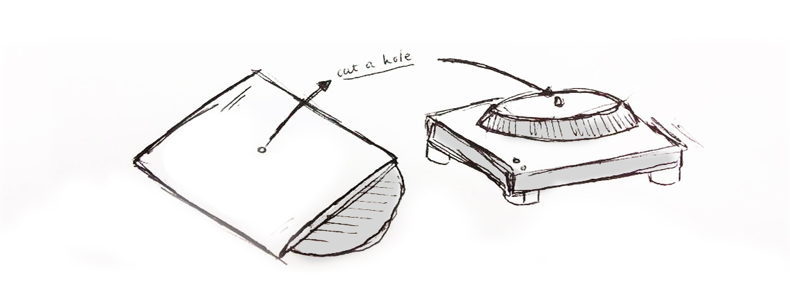
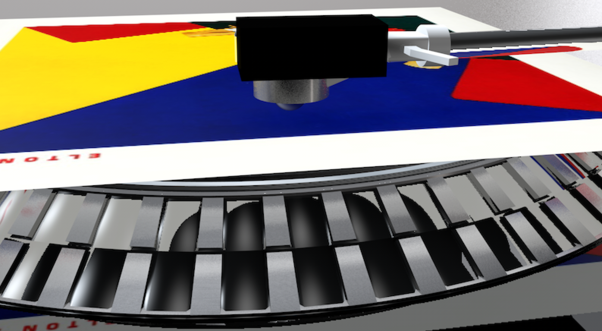
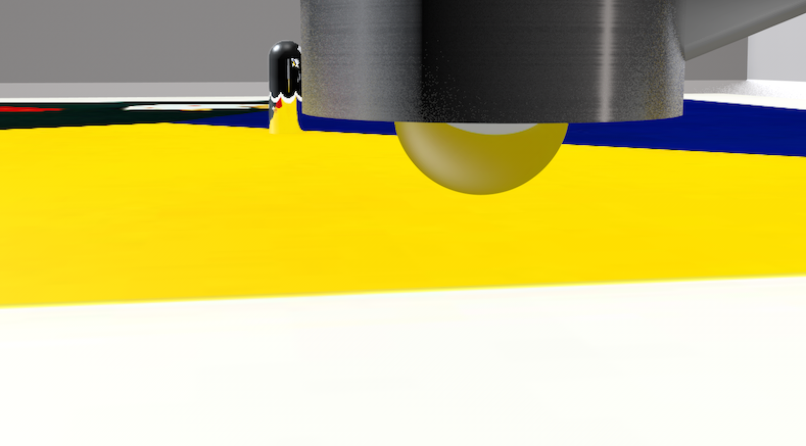
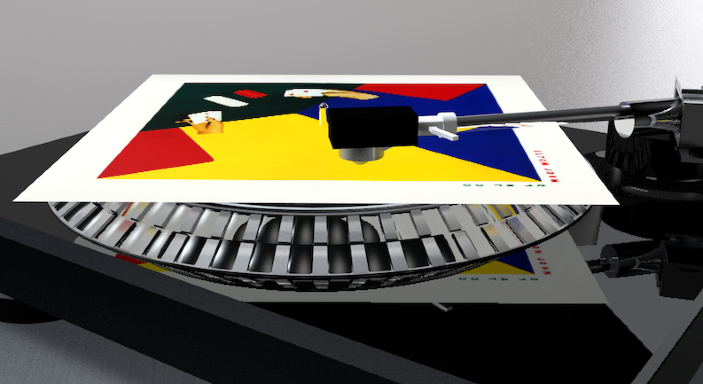
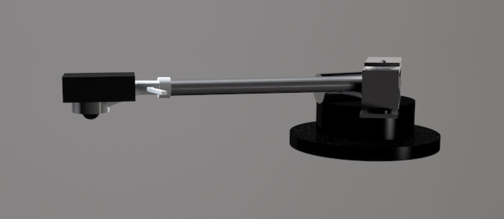
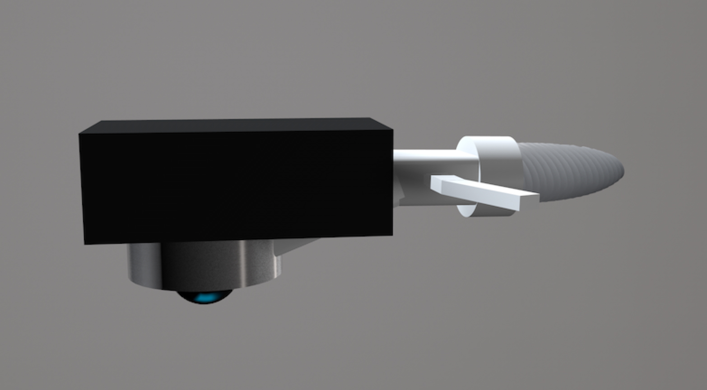
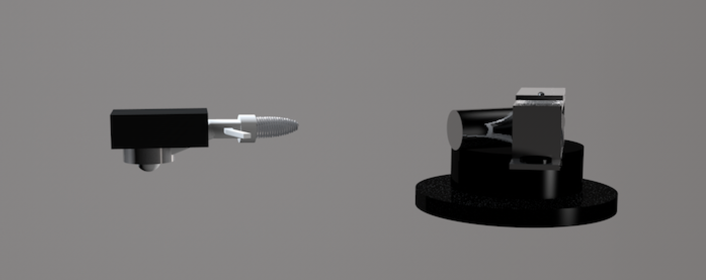

# Kimberley's Tools

## Color Picker

----
### Concept
Most of us can see color, but what would happen if we translate colors into sound? We listen to music by playing lp's on a turntable and store them in their slipcover. This color picker translates the picks the colors that are presented on the slipcover instead of the sounds on your lp. With this you are able to not only listen to your lp's but also the slipcover. Does it fit with the sounds of your genre?

The needle of the turntable will be replaced with an new object which is linked to an Arduino and will send the the information to your turntable which will play the sounds immediately. 

The Color picker picks the color based on the Color Theory from Alexander Scriabin. Inspired by Artificial Synesthesia/Chromesthesia.
###Sketch




### Prototype

#####[Movie](Sketch-03.mov)
<br>
[Movie on Vimeo](https://vimeo.com/154961098)
<br>
~~Privacy code: Video ~~
<br>
<br>




### LP-Screwhead





## Your Own Tool
----

###NOSArticleScraper

`NOSArticleScraper`is a tool to not use the ctrl+c and ctrl+v anymore when you want to use text or images of an article on the web. 

#### NOSArticleScraper?

NOSArticleScraper is a tool where you can choose an article of NOS (www.nos.nl). And easily archive all the content of the article on your computer, ready for use. When you copy the url of the chosen article you can place this in the code. The code will make an folder called NOS on your Desktop and it will be filled with articles of choice. 

In the folder named NOS will be a folder called img and a .txt file. The .txt file will be filled with the content of the article. The img folder will contain all the images of the chosen article. 

The .txt file contains: 

- Date time
- Extra Date time information
- Title 
- URL of picture
- Article text


### Sketch


### Demo
#####[Movie](Sketch-03.mov)
<br>
[Movie on Vimeo](https://vimeo.com/154961098)
<br>
~~Privacy code: Video ~~


### How to install and use
To use `NOSArticleScraper`you should have:
#####Python requests: 
http://docs.python-requests.org/en/master/

#####BeautifulSoup Library: 
http://www.crummy.com/software/BeautifulSoup/bs4/doc/


<br>
Open the NOSArticleScraper.py and place the url between the ".."


```
url = ".."
```
 
click cmd+r or Run and you have it, your NOSArticleScraper is working and the files should be located on your desktop. 


