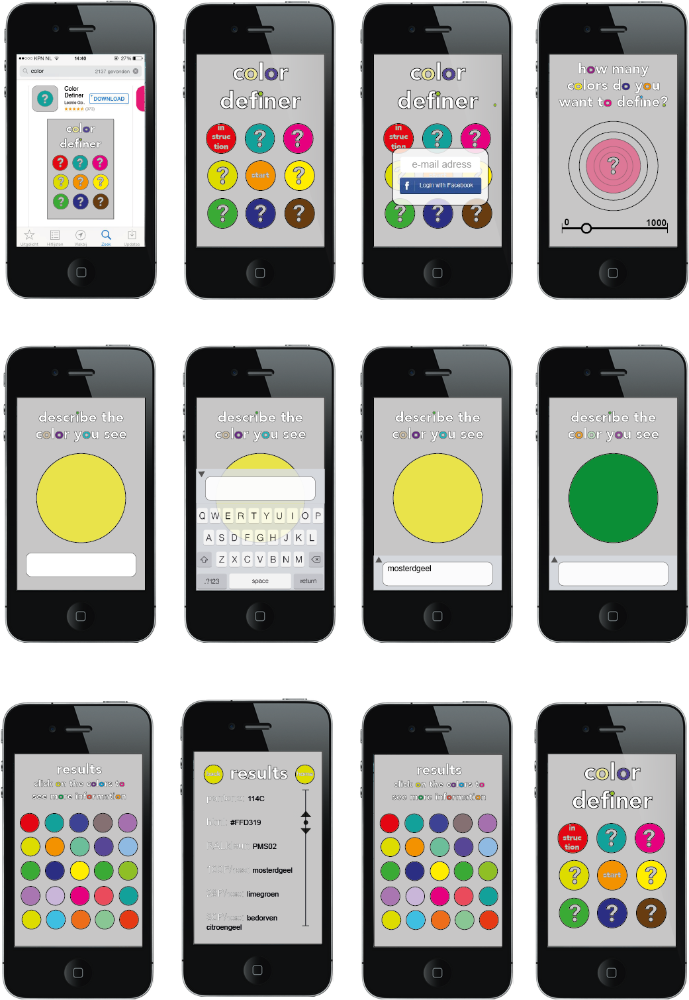

# Leonie's Tools

## Color Picker

##### the  color definer
the colordefiner is a game where you and your friends become colordefiners. You will be part off a collective that will give colors a good name again. How do you refer colors to objects ore other things? 

#####install the game
you will find the game in your app store. Search for colordefiner and you will find the app. Install it and log in with your facebook or e-mailadress to be connected to the rest of the users and you can see everyones results. 
You can also play as anonymous.

#####how to play the game
first choose how many colors you want to define, and thus how long you want to play. then push the circle and you will start

there will be a circle filled with a color and a textbox. Click on the textbox and define the color, try to be as specific as possible. When you defined the color properly, push the circle and the next color will come. This will go on untill all colors are defined. 
Then you will see an overview of all colors. If you want to see how the colors are defined by other players and different brands then just click on a color you want to see. If you want to start again just click on the home button and start all over. 

#####dependencies

#####The MIT License (MIT)

Copyright (c) 2016 Graphic Design Arnhem at ArtEZ Academy

Permission is hereby granted, free of charge, to any person obtaining a copy
of this software and associated documentation files (the "Software"), to deal
in the Software without restriction, including without limitation the rights
to use, copy, modify, merge, publish, distribute, sublicense, and/or sell
copies of the Software, and to permit persons to whom the Software is
furnished to do so, subject to the following conditions:

The above copyright notice and this permission notice shall be included in all
copies or substantial portions of the Software.

THE SOFTWARE IS PROVIDED "AS IS", WITHOUT WARRANTY OF ANY KIND, EXPRESS OR
IMPLIED, INCLUDING BUT NOT LIMITED TO THE WARRANTIES OF MERCHANTABILITY,
FITNESS FOR A PARTICULAR PURPOSE AND NONINFRINGEMENT. IN NO EVENT SHALL THE
AUTHORS OR COPYRIGHT HOLDERS BE LIABLE FOR ANY CLAIM, DAMAGES OR OTHER
LIABILITY, WHETHER IN AN ACTION OF CONTRACT, TORT OR OTHERWISE, ARISING FROM,
OUT OF OR IN CONNECTION WITH THE SOFTWARE OR THE USE OR OTHER DEALINGS IN THE
SOFTWARE.

### Concept & Sketch

### Prototype

## Your Own Tool

### Concept

### Sketch

### Demo

### How to install and use

## Other Homework

