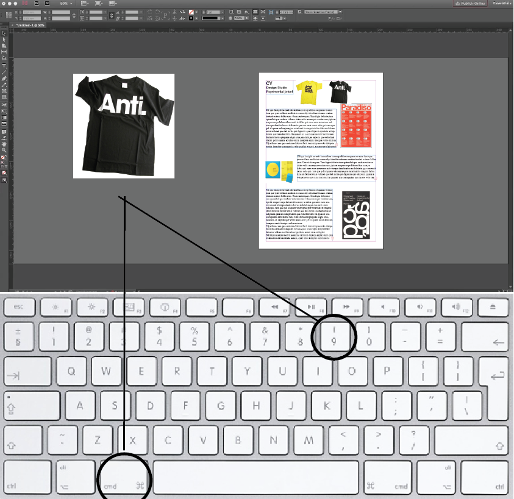

# Lola's Tools

## Color Picker

### Concept & Sketch

“My favourite photo”

This colour picker tool is meant for your favourite photo. 
We all have this one photo that we love.

With this tool this one photo becomes more than just a photo, I want that the tool creates a few points in the picture and takes a colour from that, for example 9 different points, so 9 different colours. When you load an image that excises just out of one colour (the 9 different colour points from the photo) and google image search gives it a name. I want that this automatically happens with all the 9 points.
After this step we are left with 9 different names.
I want that these 9 names are being put into Pinterest one by one. When Pinterest loads you see only one colour from the pictures it gives. I want that the tool saves these colours from the first 4 photos. When the images are fully loaded i want that also the first 4 photos Pinterest displays are being saved.

When this happens with all the 9 different its creates 36 new colours en 36 new images, all been derived from your one favourite photo. 

### Prototype

[prototype](demo_colourpickertool.mov)

if the link doesnt work, this is another link to a youtube video: 

[demo colourpicker tool](https://youtu.be/BDU5DbAUTLE)

## Your Own Tool

### Concept

“Indesign photo editor”

This year i came across an problem for the second time, i wanted to easily import (or type) with pictures. I don’t want to import a photo every time i need to use it, i just want to “type” with pictures.

So i came to the idea to make this tool, It is an more easy way to make use of pictures.
It works in indesign, the photos are linked to a short key. command 1 till 9. For example you can link your logo, business card, book cover, portrait, or something else, photos that u use allot.

When you press command 1 a photo appears on your indesign file. It automatically finds a white space where it can be placed. So you don’t have to place it yourself. When you are not happy with the size the photo is just click on it and it will get bigger or smaller it depends on the white space there is left.  
Press command 2 and for example your logo appears, and again it automatically finds a white space where it can be placed. 
This is possible with all the 9 different short keys. 

### Sketch

sketch cmd 1 

sketch cmd 2 

sketch cmd 3 

sketch cmd 4 

sketch cmd 5 

sketch cmd 6 

sketch cmd 7 

sketch cmd 8 

sketch cmd 9 

### Demo

[demo](demo_indesign_tool.mov)

if the link doesnt work, this is another link to a youtube video: 

[demo indesign tool](https://youtu.be/xR0k8yGc604)

### How to install and use

## Other Homework

