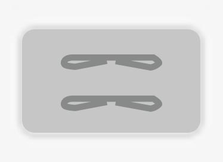

# Marianne's Tools

## Color Picker


### Concept & Sketch

BIN MIXER

With placing files to your computer's trash bin, you are changing the color of your desktop image. The script registers the files that are placed in the bin location en adjusts the RGB-composition. Formats are divided into 3 kinds: images (jpeg, png, bmp, gif), multimedia (mp3, mp4, mov, wov) and other (folder, zip, disk, txt, rtf).

IF you empty the trash bin, the parameters are set to 0. So the color will be black again, ready to get lighter and more saturated. 


### Prototype

[Movie on Vimeo](https://vimeo.com/159337264) 
<br>
ww: prototype


## Your Own Tool

### Concept

TRAVEL TEXT TOOL

A tool that transforms webpages into a readable, easy to handle PDF-file, that only has to be fold and stapled. The script scrapes the text from the webpage with beautifulsoup and pastes it in a PlotDevice-code that designs the page. It prints the text in a 2 column a5 format to a PDF file, that only has to be re-ordered to be finished as a booklet ready to print.

The reason why this would be helpful, is because I often stumble upon interesting webpages or articles that I really want to read but keeps me from my tasks. Everyday I travel by train in a total of 40 minutes and would like to read the texts while I sit in the train. I don't like reading from a screen so a ready-to-go code to transform these texts would be very helpful.

It is a browser plugin, that exists of a small python script that runs on the back. When pushing the 'Make PDF'-button, the program runs and saves the PDF file on a chosen location in your computer.

### Sketch

To show how many paper it will save to print in this format instead of the default 'print this page' function.





### Scripts

Script from scraping the rich text of main-content from an url >
<br>
[SCRAPING](BS.pv)

```
from bs4 import BeautifulSoup
import urllib
r = urllib.urlopen('http://www.vice.com/nl/read/kan-een-lettertype-racistisch-zijn-090').read()
soup = BeautifulSoup(r)
# letters = soup.find_all("div", class_="article-content-inner")
print soup.article-content-rich-text
```
<br>
[SCRAPING 2](BS2.pv)

```
import requests
import bs4
from bs4 import BeautifulSoup
import urllib2
url = "http://www.vice.com/nl/read/kan-een-lettertype-racistisch-zijn-090"


soup.find_all('http://www.vice.com/nl/read/kan-een-lettertype-racistisch-zijn-090', class_="article-content rich-text")
```
<br>
Script for design of an output A5 pdf >
[DESIGN A5](indeling.pv)

```
size(420, 595)
txt = """Elke twee weken maakt schrijver/kunstenaar Jan Hoek een lijstje van de vijf kunstwerken die zijn kunstenaarshart sneller lieten kloppen. Deze week bespreekt hij met KABK-student Erik van der Veen de belangrijke vraag: kunnen lettertypes racistisch zijn? Of anders op zijn minst een tikkie stereotyperend?

Ikzelf had ook nooit nagedacht over deze vraag. Ik had dan ook nog nooit een lettertype de Hitlergroet zien doen of dingen horen zeggen als: "Ik heb niks tegen Noord-Afrikanen, maar ze moeten met hun vieze aanrandpoten wel lekker ons land uit!"

En jullie hoeven ook niet allemaal boos te gaan worden omdat jullie vroeger weleens een lettertype hebben gebruikt en daar fijne herinneringen aan hebben, en nu denken dat ik ga zeggen dat jullie daarom dus vieze vuile gore racisten zijn, want dat is niet waar dit stukje over gaat.

Het zit namelijk zo: op de open dag van de KABK (Koninklijke Academie voor Beeldende Kunsten) in Den Haag liep ik op de afdeling graphic design tegen een boekje aan met de korte maar krachtige titel: How Does a Typeface Get Associated with Racism and Ethnicity: It is not as black & white as it might seem sometimes. 
Als ik de maker, Erik van der Veen, bel omdat ik ook wel antwoord wil op deze vraag begint hij ietwat verontschuldigend te vertellen dat racisme natuurlijk een groot woord is en dat weinig mensen zich echt verschrikkelijk gekwetst voelen door een lettertype.

"Maar," voegt hij daar gelijk aan toe, "het is nu natuurlijk wel een tijd waarin we alles onder de loep nemen. En veel lettertypes die we gebruiken om de sfeer van een bepaald gebied neer te zetten, zijn vaak vrij stereotiep, terwijl ze historisch gezien vaak helemaal niet uit het land komen dat ze moeten uitbeelden. Als je bijvoorbeeld in het Aziatische vak kijkt van de supermarkt, dan zie je dat veel merken nog steeds zo'n primitief bamboe-achtig lettertype gebruiken met een plaatje van een knalgele Chinees met spleetogen. Ik vraag me nu met alle ophef rondom Zwarte Piet dan toch wel af of daar dan niet ook wat kritischer naar gekeken moet worden."

In zijn boek heeft Erik onderzoek gedaan naar twaalf verschillende lettertypes. Hij heeft eerst onderzocht hoe het lettertype tot stand is gekomen. Vervolgens heeft hij gekeken hoe het lettertype daarna gebruikt werd en wat de impliciete boodschap daarvan is.

Hier in dit stukje zullen we vijf van deze lettertypes bespreken. De conclusies zijn van Erik zelf en staan hier zoals ze in het boek te vinden zijn, in het lettertype waar het om gaat. Omdat de KABK een internationale academie is, is dat in het Engels. Mocht je moeite hebben met deze exotische taal, dan word je waarschijnlijk niet heel vaak uitgenodigd op verjaardagen."""


font('Minion Pro', 10)


# layout(spacing=0) # add 1 lineheight of extra space
# text(220,30, 175, str=txt)


t = text(25,30 , 175, 555, str=txt)
for block in t.flow(2):
    block.x += block.width + 20
```


### Demo

[Movie on Vimeo](https://vimeo.com/159336373) 
<br>
ww: prototype


### How to install and use

Programs required:
python
pip
beautifulsoup4

As a browser plugin, that exists of a small python script that runs on the back. When pushing the 'Make PDF'-button, the program runs and saves the PDF file on a chosen location in your computer. 

Can be downloaded from Github or where ever and is free to use or edit.


## Other Homework

