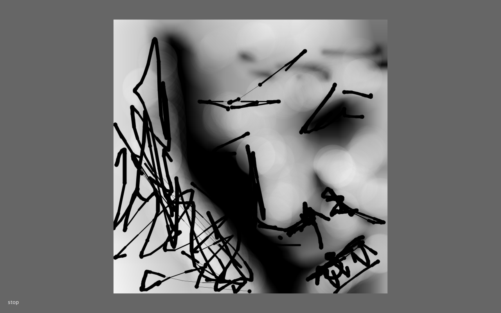
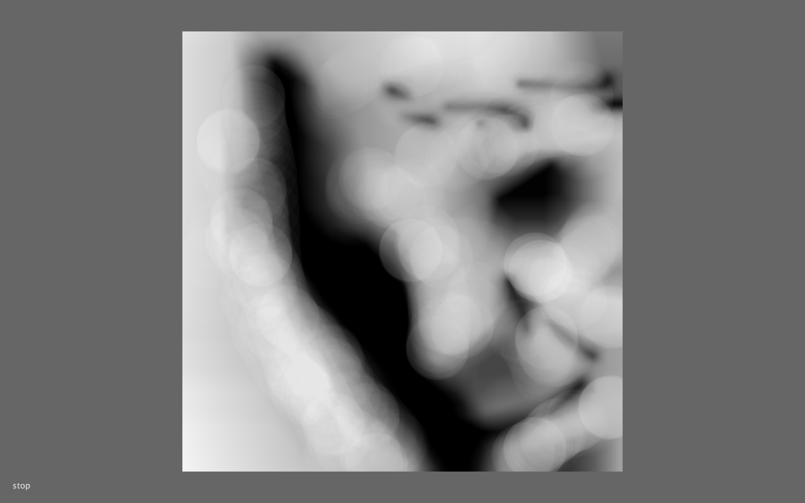
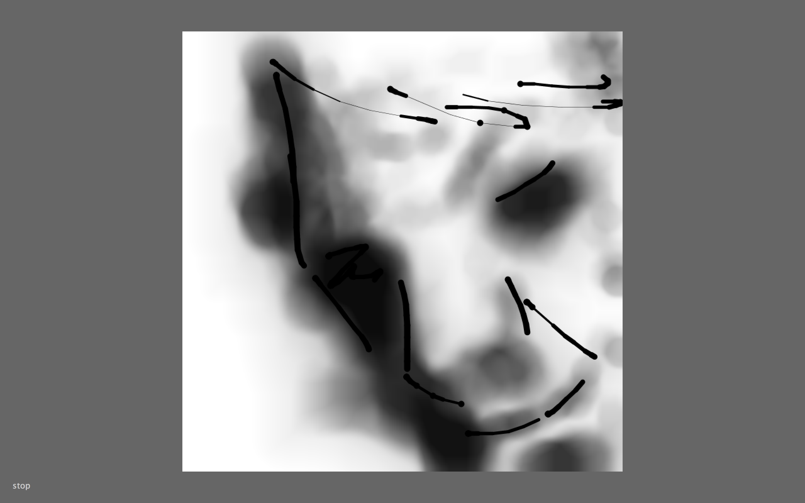
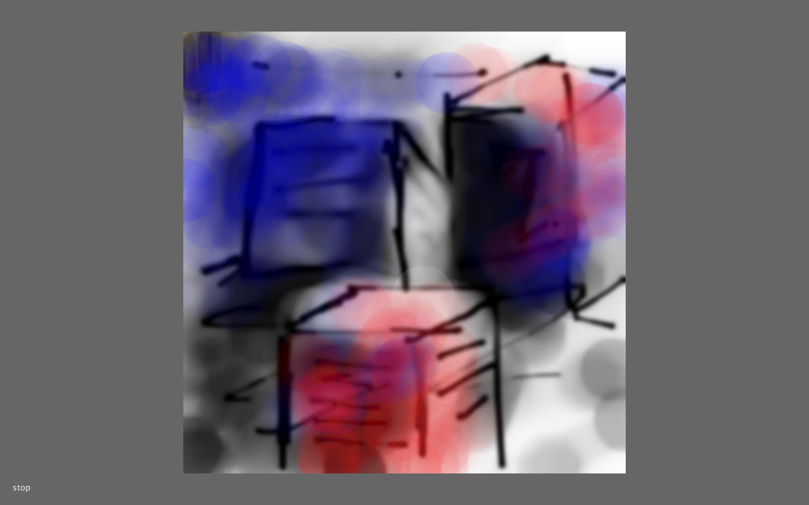
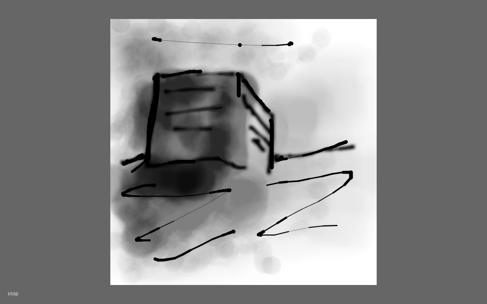

# Martijn's Tools

## Color Picker

### Concept & Sketch
A colorpicker that enables you to see the original color pigments. By dragging the mouse over different colors you get historic information about these colors.

### Prototype
[Historic colorpicker](historiccolorpickeraf.mov)

## Your Own Tool

### Concept

I wanted to make a tool that makes the drawing with a mouse or trackpad on a computer more natural. So i figured out that using the keyboard is a great adventage when draing with a mouse or trackpad.

 

void setup () { size (700,700); background (255); smooth(); }

int cs = 70; float speedLine; void draw () { speedLine = abs (mouseX-pmouseX); println (speedLine); //frameRate (10); noStroke(); smooth();

if (keyPressed) {

if (key=='1'){ 
stroke(0, 50); strokeWeight(0.1+speedLine/20); //line(mouseX, mouseY, width, mouseX); //line(mouseX, mouseY, 0, mouseX); stroke(0); strokeWeight(10 - min(speedLine/5, 9.5)); line(pmouseX, pmouseY, mouseX, mouseY);}

if (key=='2'){ 
stroke(0, 50); strokeWeight(0.1+speedLine/20); //line(mouseX, mouseY, width, mouseX); //line(mouseX, mouseY, 0, mouseX); stroke(0,0,0,10); strokeWeight(100 - min(speedLine, 50)); line(pmouseX, pmouseY, mouseX, mouseY);}

if (key=='3'){ 
stroke(0, 50); strokeWeight(0.1+speedLine/20); //line(mouseX, mouseY, width, mouseX); //line(mouseX, mouseY, 0, mouseX); stroke(0,0,0,3); strokeWeight(50 - min(speedLine, 50)); line(pmouseX, pmouseY, mouseX, mouseY);}

if (key=='4'){ 
stroke(0, 0); strokeWeight(0.1+speedLine/20); //line(mouseX, mouseY, width, mouseX); //line(mouseX, mouseY, 0, mouseX); stroke(0,0,0,1); strokeWeight(150 - min(speedLine, 50)); line(pmouseX, pmouseY, mouseX, mouseY);}

if (key=='y') {
stroke(0, 20); strokeWeight(0.9+speedLine/20); //line(mouseX, mouseY, width, mouseX); //line(mouseX, mouseY, 0, mouseX); strokeWeight(30 - min(speedLine/5, 9.5)); ellipse(pmouseX, pmouseY, random(10,5), random(50,60));} fill(0,0,0,20);

if (key=='5') {
stroke(0, 20); strokeWeight(0.9+speedLine/20); //line(mouseX, mouseY, width, mouseX); //line(mouseX, mouseY, 0, mouseX); strokeWeight(30 - min(speedLine/5, 9.5)); ellipse(pmouseX, pmouseY, random(6,10), random(50,100));} fill(0,0,0,20);

if (key=='0'){ 
stroke(0, 50); strokeWeight(0.1+speedLine/20); //line(mouseX, mouseY, width, mouseX); //line(mouseX, mouseY, 0, mouseX); stroke(0,0,0,10); strokeWeight(100 - min(speedLine, 20)); line(pmouseX, pmouseY, mouseX, mouseY);}

if (key=='0') {
stroke(0, 200); strokeWeight(5-min(speedLine/1, 4.5)); //line(mouseX, mouseY, width, mouseX); //line(mouseX, mouseY, 0, mouseX); stroke(0,0,0,20);

strokeWeight(50 - min(speedLine/5, 9.5)); line(pmouseX, pmouseY, mouseX, mouseY);}

if (key=='z') {

stroke(0, 20); strokeWeight(0.9+speedLine/20); //line(mouseX, mouseY, width, mouseX); //line(mouseX, mouseY, 0, mouseX); strokeWeight(30 - min(speedLine/5, 9.5)); ellipse(pmouseX, pmouseY, random(40,60), random(5,10));} fill(0,0,0,20);

if (key=='5') {
stroke(0,00); strokeWeight(0.1+speedLine/200); //line(mouseX, mouseY, width, mouseX); //line(mouseX, mouseY, 0, mouseX); stroke(255, 204, 0,5); strokeWeight(100 - min(speedLine, 95)); line(pmouseX, pmouseY, mouseX, mouseY);}

if (key=='6') {
stroke(0,00); strokeWeight(0.1+speedLine/200); //line(mouseX, mouseY, width, mouseX); //line(mouseX, mouseY, 0, mouseX); stroke(255, 0, 0,5); strokeWeight(100 - min(speedLine, 95)); line(pmouseX, pmouseY, mouseX, mouseY);}

if (key=='7') {
stroke(0,00); strokeWeight(0.1+speedLine/200); //line(mouseX, mouseY, width, mouseX); //line(mouseX, mouseY, 0, mouseX); stroke(0, 0, 255,5); strokeWeight(100 - min(speedLine, 95)); line(pmouseX, pmouseY, mouseX, mouseY);}

if (key=='8') {
stroke(0,00); strokeWeight(0.1+speedLine/200); //line(mouseX, mouseY, width, mouseX); //line(mouseX, mouseY, 0, mouseX); stroke(255, 255, 255,5); strokeWeight(100 - min(speedLine, 95)); line(pmouseX, pmouseY, mouseX, mouseY);} if (key=='9') filter (BLUR,1); if (key=='+') filter (GRAY);

if (key=='-') {
stroke(0,00); strokeWeight(0.1+speedLine/200); //line(mouseX, mouseY, width, mouseX); //line(mouseX, mouseY, 0, mouseX); stroke(255, 255, 255,300); strokeWeight(300 - min(speedLine, 95)); line(pmouseX, pmouseY, mouseX, mouseY);}

} }
### Demo

[tool](pentool.mov)

### How to install and use

To install my tool you have to download Processing first https://processing.org/
then you copy and paste the code. And run it within Processing

You can use This tool for sketching quick ideas, the advantage of drawing on a computer is that it is easier to save your sketches without losing them, it also saves a lot of paper.

My tool was made for Mac Osx

The MIT License (MIT)

Copyright (c) <2016> <Martijn de Lange>

Permission is hereby granted, free of charge, to any person obtaining a copy of this software and associated documentation files (the "Software"), to deal in the Software without restriction, including without limitation the rights to use, copy, modify, merge, publish, distribute, sublicense, and/or sell copies of the Software, and to permit persons to whom the Software is furnished to do so, subject to the following conditions:

The above copyright notice and this permission notice shall be included in all copies or substantial portions of the Software.

THE SOFTWARE IS PROVIDED "AS IS", WITHOUT WARRANTY OF ANY KIND, EXPRESS OR IMPLIED, INCLUDING BUT NOT LIMITED TO THE WARRANTIES OF MERCHANTABILITY, FITNESS FOR A PARTICULAR PURPOSE AND NONINFRINGEMENT. IN NO EVENT SHALL THE AUTHORS OR COPYRIGHT HOLDERS BE LIABLE FOR ANY CLAIM, DAMAGES OR OTHER LIABILITY, WHETHER IN AN ACTION OF CONTRACT, TORT OR OTHERWISE, ARISING FROM, OUT OF OR IN CONNECTION WITH THE SOFTWARE OR THE USE OR OTHER DEALINGS IN THE SOFTWARE.
 

## Other Homework

