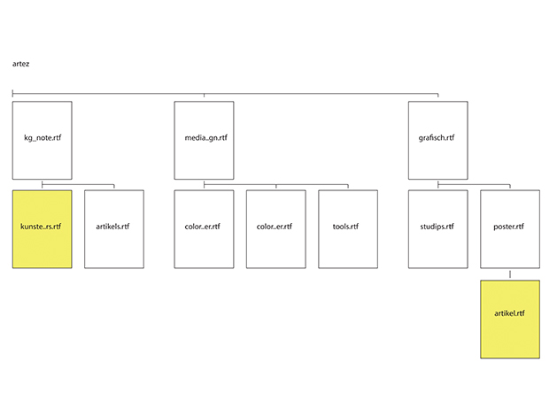

# Max's Tools

## Color Picker

### Concept & Sketch
 

Color Printer App

With this color picker tool, you’ll never have to worry about having the wrong colors again. 

It works as follows:
So you’re working in photoshop… indesign.. illustrator or another adobe program. 
You are adding a swatch to your swatch panel because it looks great in the design you are currently working on, and you want to save it for later… 

But.. most of the time, your design will surpass your screen and be printed on paper. Will your beloved colors hold the same charisma as they had digitally? With this color picker you don’t have to second guess yourself, you add the swatch to your swatch panel, and it will automatically send a document to your default printer, and with the practical design, you can also add it to your own color steel card.

### Prototype

####[Demo](https://vimeo.com/159070718)
Password: MediaDesign2016

#####The MIT License (MIT)

Copyright (c) 2016 Graphic Design Arnhem at ArtEZ Academy

Permission is hereby granted, free of charge, to any person obtaining a copy of this software and associated documentation files (the "Software"), to deal in the Software without restriction, including without limitation the rights to use, copy, modify, merge, publish, distribute, sublicense, and/or sell copies of the Software, and to permit persons to whom the Software is furnished to do so, subject to the following conditions:

The above copyright notice and this permission notice shall be included in all copies or substantial portions of the Software.

THE SOFTWARE IS PROVIDED "AS IS", WITHOUT WARRANTY OF ANY KIND, EXPRESS OR IMPLIED, INCLUDING BUT NOT LIMITED TO THE WARRANTIES OF MERCHANTABILITY, FITNESS FOR A PARTICULAR PURPOSE AND NONINFRINGEMENT. IN NO EVENT SHALL THE AUTHORS OR COPYRIGHT HOLDERS BE LIABLE FOR ANY CLAIM, DAMAGES OR OTHER LIABILITY, WHETHER IN AN ACTION OF CONTRACT, TORT OR OTHERWISE, ARISING FROM, OUT OF OR IN CONNECTION WITH THE SOFTWARE OR THE USE OR OTHER DEALINGS IN THE SOFTWARE.

## Your Own Tool

### Concept

NoteHelper

With this app, the computer can finally help you making your notes. In comparison to making notes in a analog way, the computer can assist you in many ways. With this app, you can compare certain words in your current note with previous notes that you have written. 

This can boost the information you are writing. Maybe some previous brainwaves you had a couple of months back, can help you with your current project or idea. 

### Sketch
####MindMap App Sketches

#####NoteHelper App Sketches

### Demo
####[Demo](https://vimeo.com/159078312)

Password: MediaDesign2016

### How to install and use

#####installation
You have to download the Notehelper.workflow and drag it into your services map. This way it will show in the services folder in your Text Edit. 

#####Usage
First you have to have a map which contain all of your notes that you want to make searchable. After you have done this, you will want to open your Text Edit. When you want to begin your comparison, you'll either have to write a text that you want to compare or you'll have to open a document that you have written earlier. In this example we opened a text document.
You have to select a word that you want to compare with your previous notes like so:

Then you have to right click your selected word and select "Notehelper" in the dropdown menu, like so:

This will give you a finder menu in which it will show your map with your notes and a selection of the files that contain the word you have selected. This is an example:

You can now open one or more of these files so you can compare the notes and write even beter texts!

###License
#####The MIT License (MIT)

Copyright (c) 2016 Graphic Design Arnhem at ArtEZ Academy

Permission is hereby granted, free of charge, to any person obtaining a copy of this software and associated documentation files (the "Software"), to deal in the Software without restriction, including without limitation the rights to use, copy, modify, merge, publish, distribute, sublicense, and/or sell copies of the Software, and to permit persons to whom the Software is furnished to do so, subject to the following conditions:

The above copyright notice and this permission notice shall be included in all copies or substantial portions of the Software.

THE SOFTWARE IS PROVIDED "AS IS", WITHOUT WARRANTY OF ANY KIND, EXPRESS OR IMPLIED, INCLUDING BUT NOT LIMITED TO THE WARRANTIES OF MERCHANTABILITY, FITNESS FOR A PARTICULAR PURPOSE AND NONINFRINGEMENT. IN NO EVENT SHALL THE AUTHORS OR COPYRIGHT HOLDERS BE LIABLE FOR ANY CLAIM, DAMAGES OR OTHER LIABILITY, WHETHER IN AN ACTION OF CONTRACT, TORT OR OTHERWISE, ARISING FROM, OUT OF OR IN CONNECTION WITH THE SOFTWARE OR THE USE OR OTHER DEALINGS IN THE SOFTWARE.

## Other Homework

