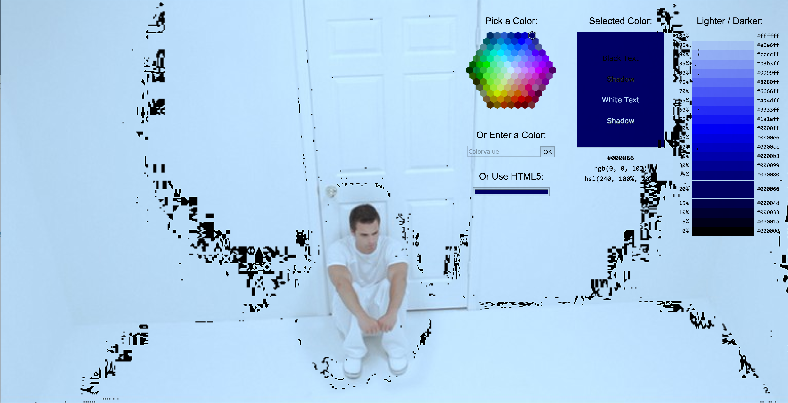
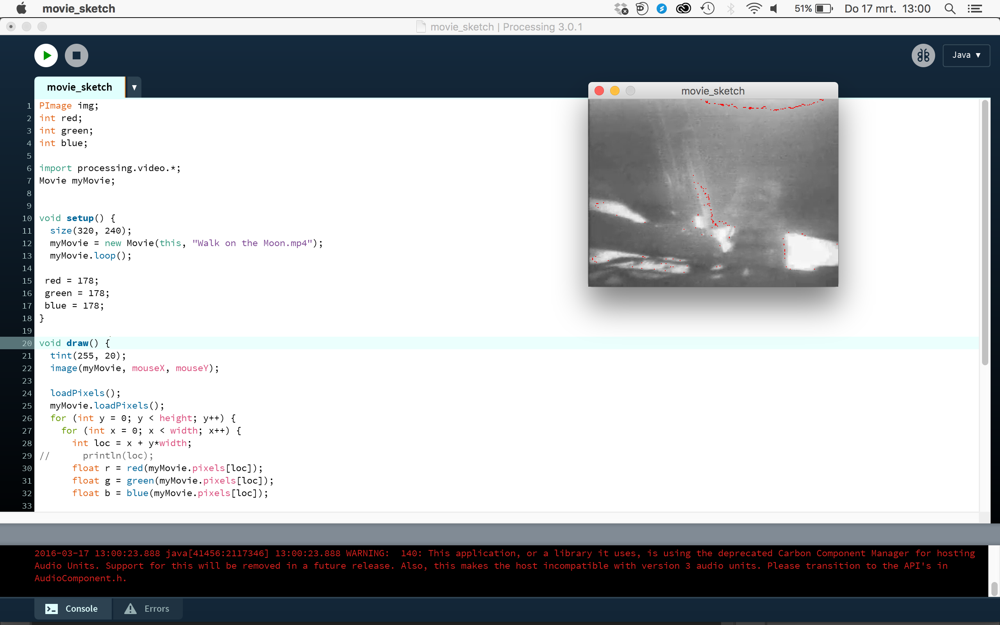
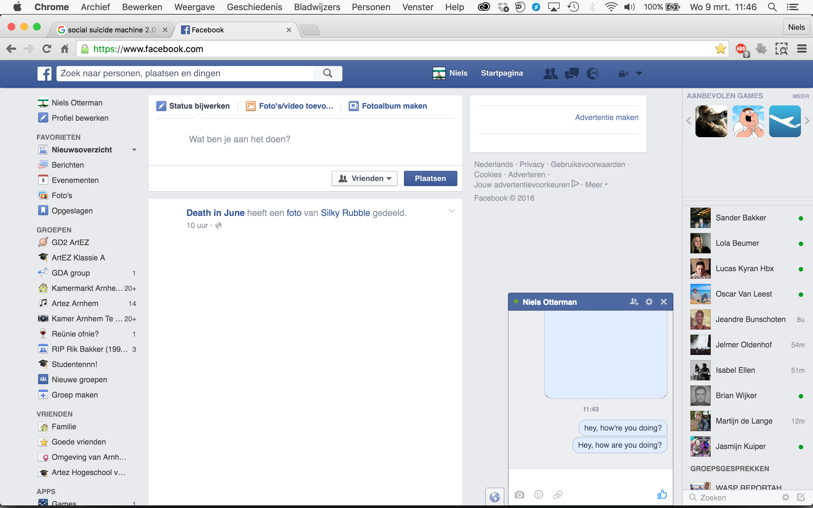
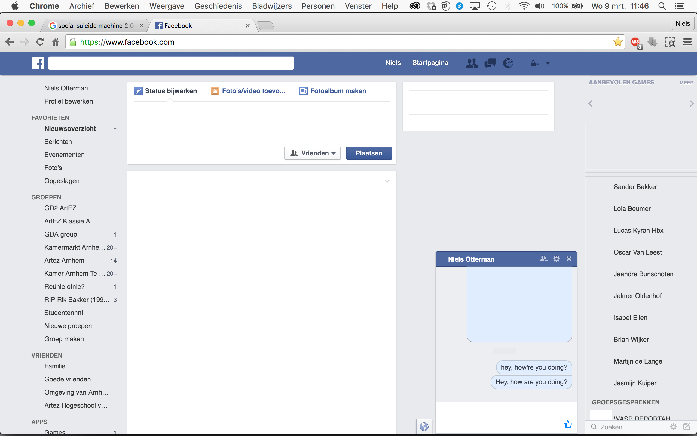

# Niels's Tools

## Color Picker

### Concept & Sketch
I made a reversed colourpicker. In Photoshop, Illustrator or another program you can pick a colour of the image and you can use that colour. But you can't pick a colour and let Photoshop search for that colour. This tool tackles that problem and search for the colour in an imago or video you've picked. It's written in Java.

 
### Prototype

PImage img;
int red;
int green;
int blue;

import processing.video.*;
Movie myMovie;

void setup() {
  size(320, 240);
  myMovie = new Movie(this, "Walk on the Moon.mp4");
  myMovie.loop();
  
 red = 178;
 green = 178;
 blue = 178;
}

void draw() {
  tint(255, 20);
  image(myMovie, mouseX, mouseY);
  
  loadPixels();
  myMovie.loadPixels();
  for (int y = 0; y < height; y++) {
    for (int x = 0; x < width; x++) {
      int loc = x + y*width;
//      println(loc);
      float r = red(myMovie.pixels[loc]);
      float g = green(myMovie.pixels[loc]);
      float b = blue(myMovie.pixels[loc]);
      
      if( r == red && g == green && b == blue){
        
        // pick here the replacement for the colour you want to replace
         r = 250;
         g = 0;
         b = 0;
      }
      pixels[loc] =  color(r,g,b);
    }
  }
  updatePixels();
  textSize(20);
}

// Called every time a new frame is available to read
void movieEvent(Movie m) {
  m.read();

## Your Own Tool

### Concept
I made a social media destroyer. It frustrates your workflow very well when you go to Facebook, Twitter or YouTube while you should work on your project. Everytime you have interaction with socialmedia, the tool noticed that and cause a breakdown in the website.

### Sketch

### Demo
https://www.youtube.com/watch?v=789b0QOp3aE&feature=youtu.be

### How to install and use
When you use Firefox go to Greasemonkey (https://addons.mozilla.org/nl/firefox/addon/greasemonkey/) and install the app, when you use Chrome you can use Tampermonkey. Go to https://greasyfork.org/nl en search for "Social Media Destroyer". Click on the link and install. 