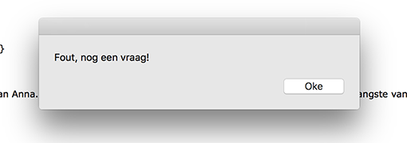

# Nikki G's Tools

## Color Picker

### Concept & Sketch

```
I wanted to create a tool where you can see the color mix, or the overall color that is used in a picture when you are making it. So my tool is an extension on your camera. When you make the picture, you dont see every detail of the picture, but only one colo0r. That is the pixel that is most used in the picture. 
```
[Demo proef](DemoKleurProef.mov)

### Prototype


<br><br>
####[Demo Color Picker](cp.mov)
<br><br>

## Your Own Tool

### Concept
```
IDEA 1
For my concentration I always put a film on the background, I listen to the film who I have seen like a thounsand times so I wont have to see the footage. But now    I wanted to make a tool that will allow your browser to stay on the front of your workarea. In a little screen in the right bottem there will be a little screen where a browser is running. 
```

```
IDEA 2
When you're realy busy with homework or an assignment, you sometimes get in a brainless workflow, so your brains need to fresh up. I wanted to make a tool where everey 15 minutes you need to reactivate your brain, so you don't come in a brainless workflow. Your brain get reactivated by this tool! 
```

### Sketch

<br>
####Sketches for idea 1


[Demo Floating Browser](DemoNetflix.mov)

####Sketches for idea 2

[Demo Reminder 1](DemoNotification.mov)


<br><br><br><br>
[Demo Reminder 2](DemoToolEind01.mov)
<br><br>
Menu


Choosen screen 1


Choosen screen 2


Choosen screen 3


### Demo

####[Tool](Tool.scpt)


"80"



"Oke"


"Sylvia"


"Oke"

#####[Tool Possebility 2](Tool01.scpt)

### How to install and use

```
Install it as a app, that is running on the background of your computer. So every 15 minutes there will be a pop-up with a math quiestion, if you have it wrong you need to answer a new quiestion till the 4th, so you can reactivate your brain. 
```

## Other Homework

