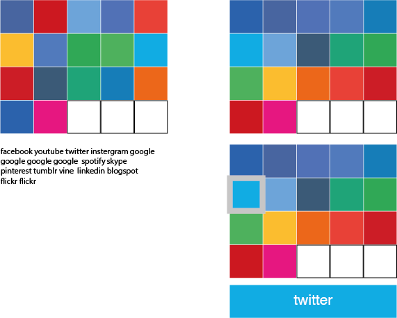
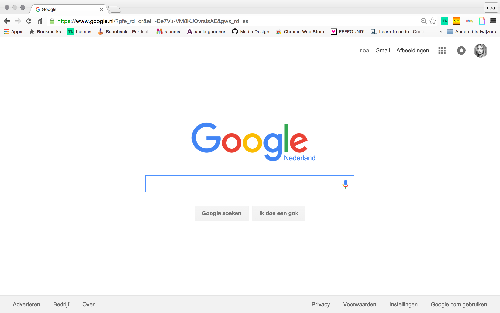
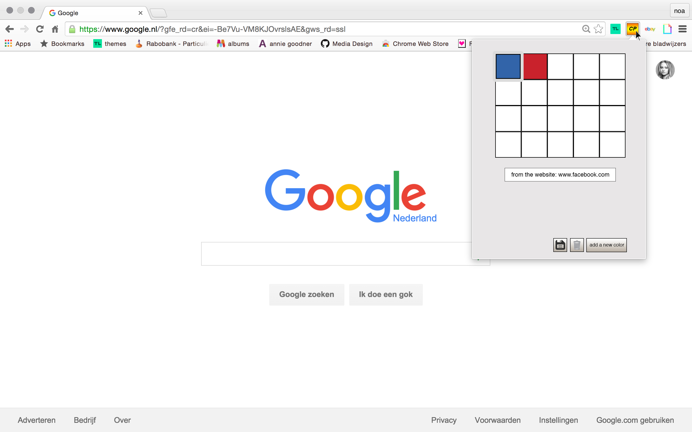
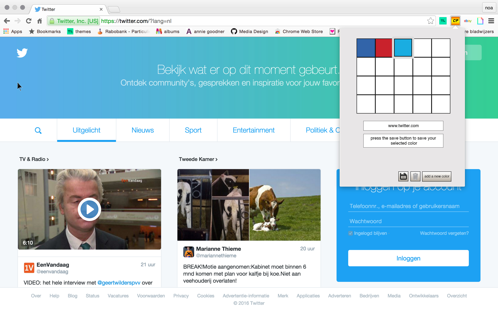
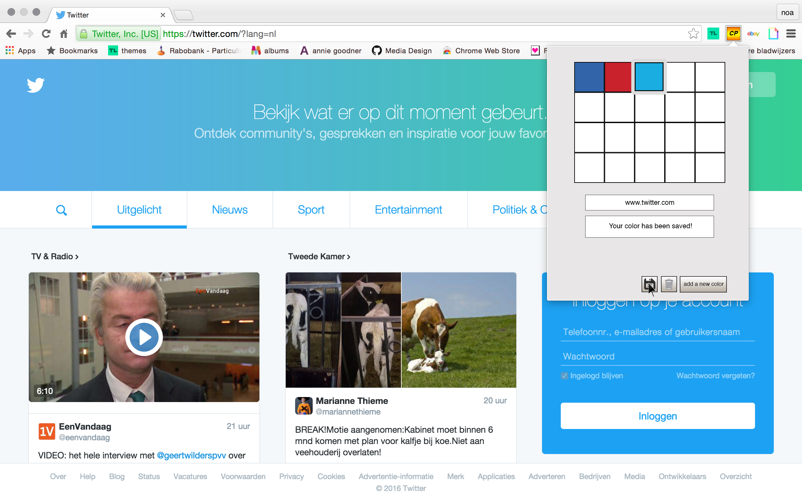
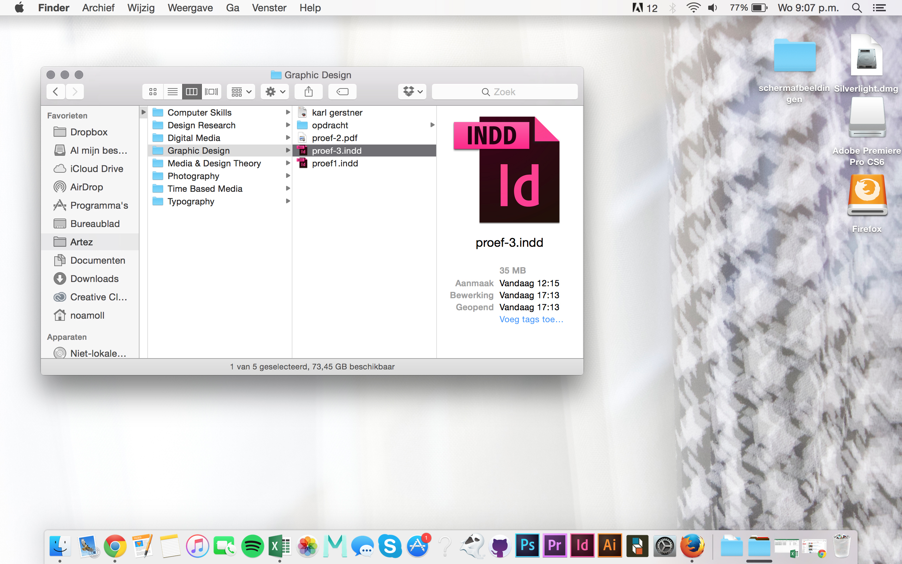
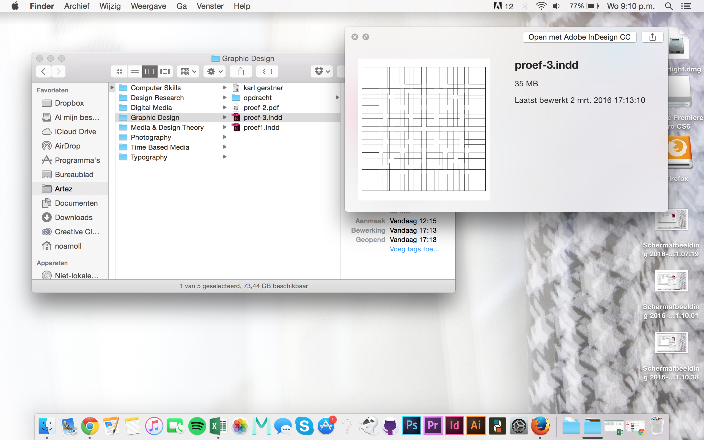
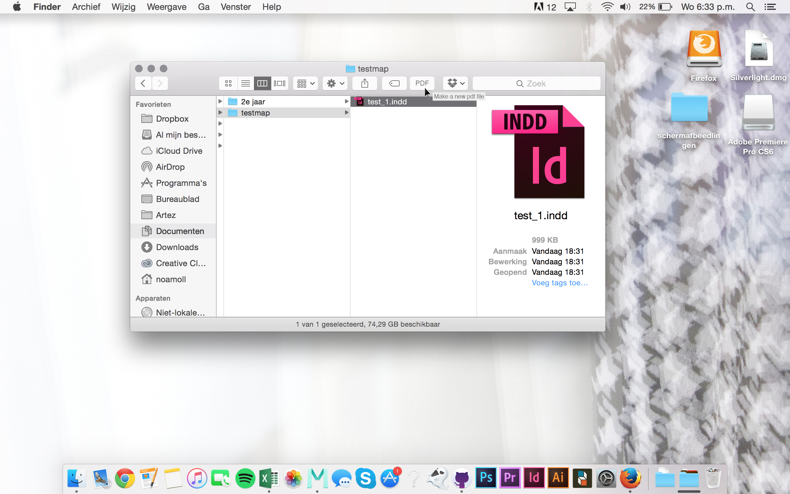
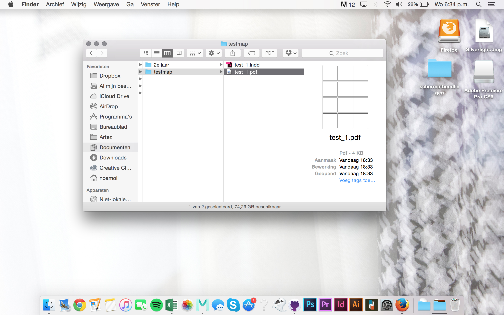
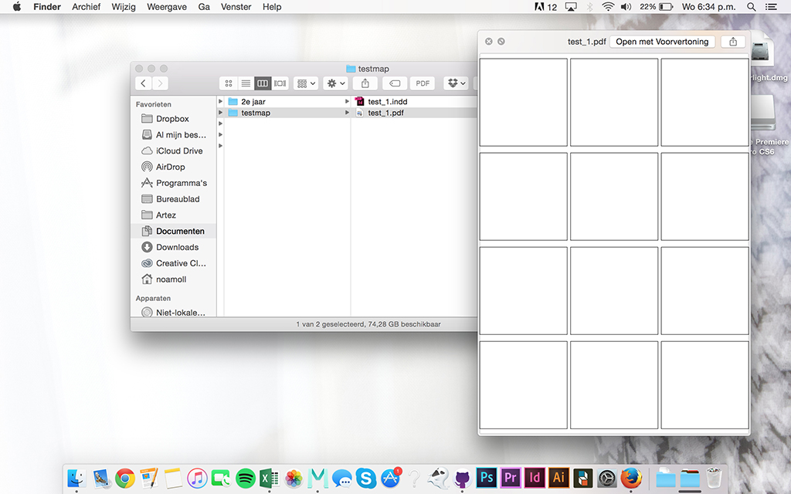

# Noa's Tools

## Color Picker

### Concept & Sketch

My concept for the color picker was being able to save a color from a webpage. This trough using a google chrome extension. Which ables you to click on the color picker tool, then click on the color in the webpage that you would like to add to you color database, and save it for later.

### Prototype

## Your Own Tool

### Concept

This tool will able you to have a preview in your finder of indesign files. Normally you have to open your indesign to see the content of an .indd file. With this tool you'll be able to create a .pdf file of your .indd file just by clicking the button you can add on your finder. So you can use this pdf file to see which file you need, without opening indesign. 

### Sketch

### Demo

### How to install and use

using the indesign scripting CS6 guide, exporting to pdf
	
extend script toolkit, automatiseren met apple script (combineren) 

gekeken naar watch folder, launch agents en fswatch.

## Other Homework

