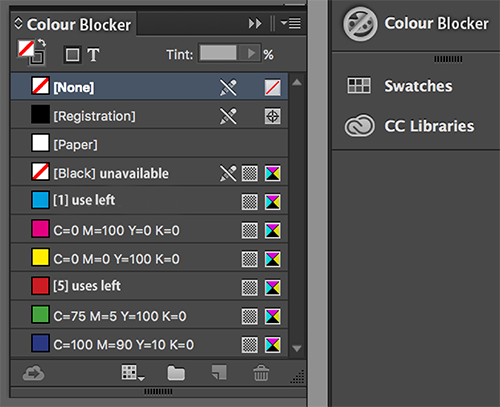

# Reinier's Tools

## Color Blocker
When you’re getting too comfortable using the same colours over and over again. You could choose to import this adobe add-on. This addon will use all the colors in your library. When you keep using the same colours everytime you are using any Adobe software this addon will block that colour. You can’t use that specific colour anymore. Why not? Because you are not using any other colours in your library. So this Adobe Add-on wil give you the oppurtunity to use all the colours in your Adobe colour library.

How to install this tool?
 
1. Go to https://creative.adobe.com/addons and search for Color Blocker.
 
2. When found click the download button in the upper-left corner.
 
3. You will follow a wizard that helps you through the installation.

### Concept & Sketch
[in software](cp_inprog.png)
 

### Prototype
[DEMO](https://www.youtube.com/watch?v=i3Rthbykako&feature=youtu.be)
## Your Own Tool
This tool is completely based on my personal brain. How does it work when I am in a situation with a negative vibe or how will react in a positive enviroment. With this tool you will learn what my perpective could be about these situations. For example someone comes up to you and says that he didnt really like your work for a class. How will I react or how do I think I have to react. You will find out right here.
### Concept
This is an applescript that is being used as some sort of application or program to visualize the idea. You will get pop-up questions about some situations where a specific reaction is needed. You could stay positive and pretend you really dont care about anything. Or you could be someone that sees everything negatively. What you have to find out is how you will get out of the loop. Is it possible to stay positive or is it really neccesary to be negative all the time.
### Proof of Concept
I tried to find some examples of code that i could use and what i think could work for this project.
the examples of code you will find [here](http://pastebin.com/NsudBEEX)
 
### Sketch
Here a small visualization of the tool how it should work.
 
[1st Attempt](https://www.youtube.com/watch?v=CgvVjsEALTo) 
 
[1st Code](http://pastebin.com/AnncccLU)
 
The problem was that i couldn't find out how i could link buttons to each other. This made it more difficult to create the loop.
 
[2nd Code](http://pastebin.com/gk3R3ehW)
 
[1st flowchart](1_flowchart.png) 
 
When i found out how to link all the buttons with a [flowchart](2_flowchart.png) and for example "on my_negeer" i could connect the dots.
 
### Demo
[2nd Attempt](https://youtu.be/0K055z--O1M)
 
[3rd Code](http://pastebin.com/KUyD3Xc7)
 
[4th Code](http://pastebin.com/pUwdQMvG)
 
When I talked about this piece of code with our Timebased Media teacher Donna Verheijden. She thought it would be good to make more use of applescript and try to look in the possibilities. With these pop-up messages you could also make some video's pop-up. Video's that are relevant to the topic. To make the visualization more living.
 
[5th Code (work in progress)](http://pastebin.com/nsqHP6c4) 
### How to install and use
For this tool you will need AppleScript Editor, this is pre-installed on every Mac/Macbook. You can open this by pressing CMD + Spacebar and type "AppleScript Editor" and press enter. Copy and paste the code from here and press the play button to run the script! 
 
 
Just in case, the tool is created on MacOS X El Capitan Version 10.11.3. When you encounter some failures in applescript you could try to solve this with making your Mac up to date to the same version. 
 

Are you a windows-user and still want to see what is happening in this script? I recommend you use A Virtual Machine or a second OS on your laptop. With a virtual machine you could virtually run a Mac OS X without even installing it. A example for a virtual machine can you find [here](http://www.vmware.com).

#### License
The MIT License (MIT)

Copyright (c) 2016 Graphic Design Arnhem at ArtEZ Academy

Permission is hereby granted, free of charge, to any person obtaining a copy of this software and associated documentation files (the "Software"), to deal in the Software without restriction, including without limitation the rights to use, copy, modify, merge, publish, distribute, sublicense, and/or sell copies of the Software, and to permit persons to whom the Software is furnished to do so, subject to the following conditions:

The above copyright notice and this permission notice shall be included in all copies or substantial portions of the Software.

THE SOFTWARE IS PROVIDED "AS IS", WITHOUT WARRANTY OF ANY KIND, EXPRESS OR IMPLIED, INCLUDING BUT NOT LIMITED TO THE WARRANTIES OF MERCHANTABILITY, FITNESS FOR A PARTICULAR PURPOSE AND NONINFRINGEMENT. IN NO EVENT SHALL THE AUTHORS OR COPYRIGHT HOLDERS BE LIABLE FOR ANY CLAIM, DAMAGES OR OTHER LIABILITY, WHETHER IN AN ACTION OF CONTRACT, TORT OR OTHERWISE, ARISING FROM, OUT OF OR IN CONNECTION WITH THE SOFTWARE OR THE USE OR OTHER DEALINGS IN THE SOFTWARE.

