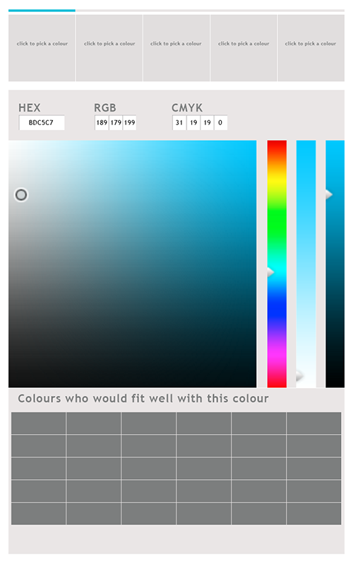
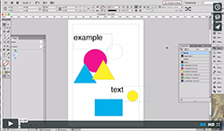

# Sietske's Tools

## Color Picker

### Concept & Sketch
Een app voor als je moeite hebt met een palette aan kleuren te kiezen.
Je kan doormiddel van deze app aan kruisen hoeveel kleuren je wilt gebruiken en dan maakt deze app een kleuren palette voor je met kleuren die mooi bij elkaar passen. 
Dit kan je vervolgens gebruiken bij verschillende programma's. 
De kleuren kunnen bestaan uit CMYK, RGB, Hex etc.

### Prototype

## Your Own Tool

### Concept
Een random tool voor Adobe inDesign voor het random zetten van je tekst en/of beelden, figuren in je document.

### Sketch 

### Demo

### How to install and use

## Other Homework

